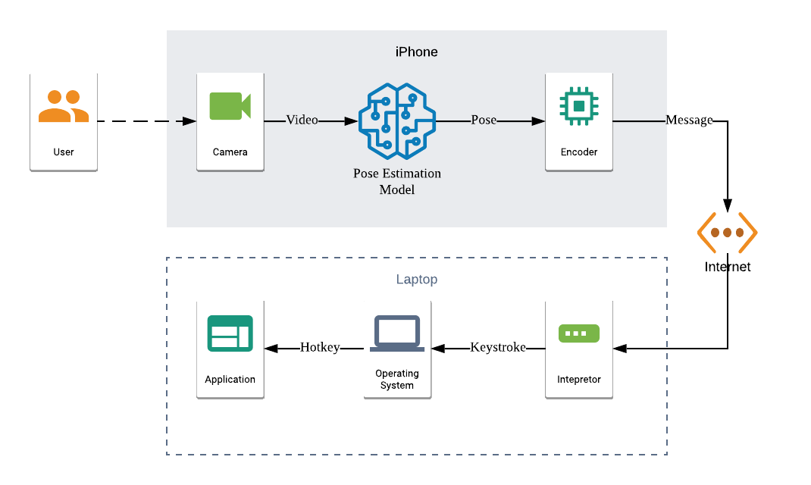
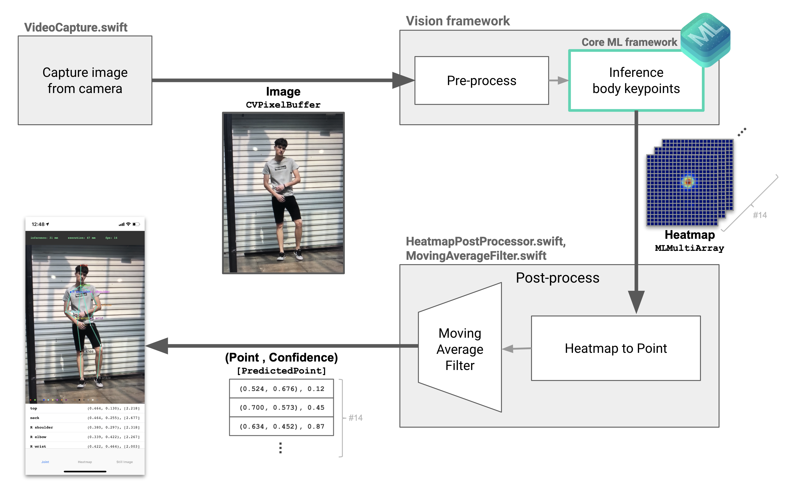

# PoseCtrl
Zhao Lei, Yifei Chen

PoseCtrl captures the user's body pose, pass it through a convolutional neural network, then outputs the result in the form of a computer command. It is most useful when the user is giving a presentation but do not want to carry a clicker with him the whole time. In those cases, the user can choose to utilize our system, 

## System Block Diagram

## Model

[PoseEstimation-CoreML](https://github.com/tucan9389/PoseEstimation-CoreML)

